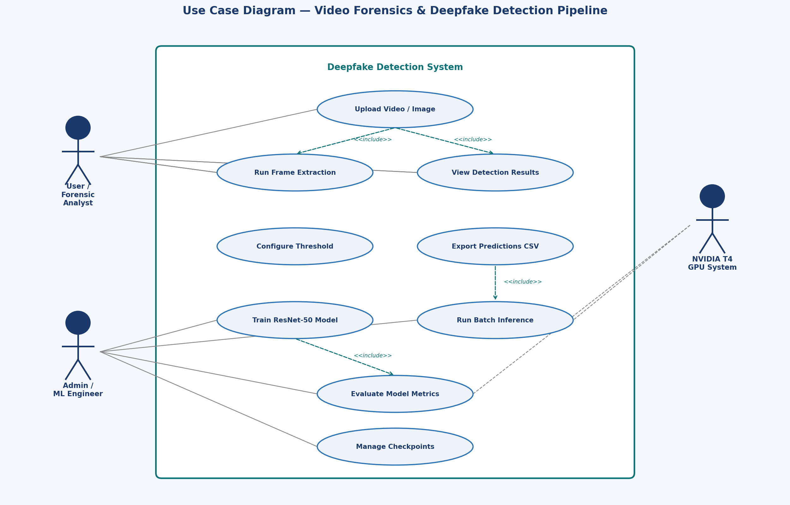
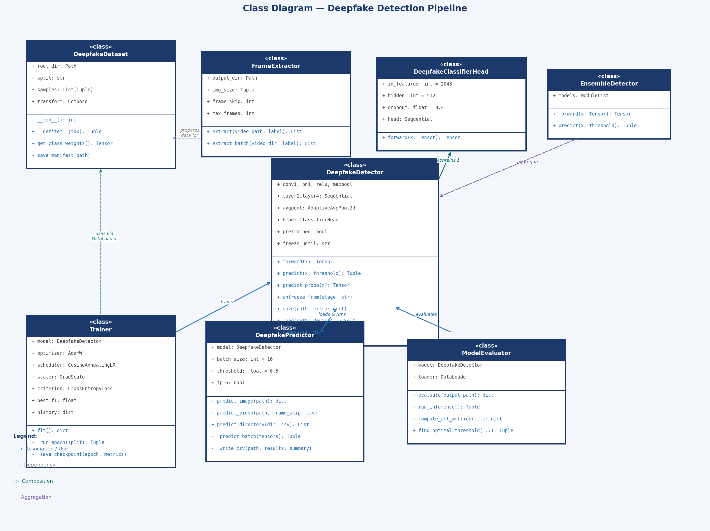
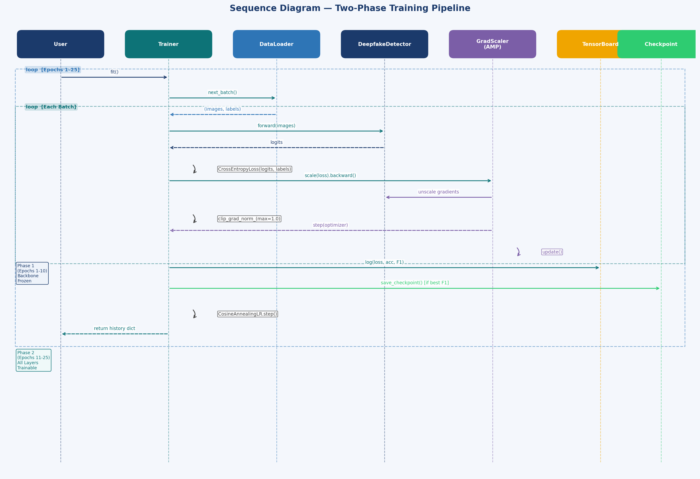
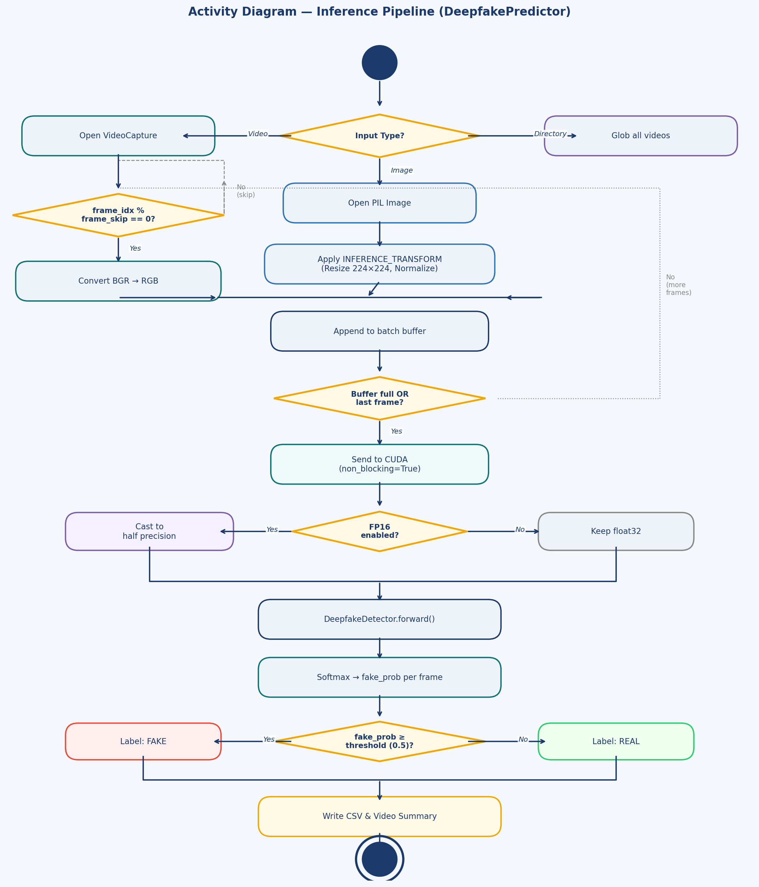
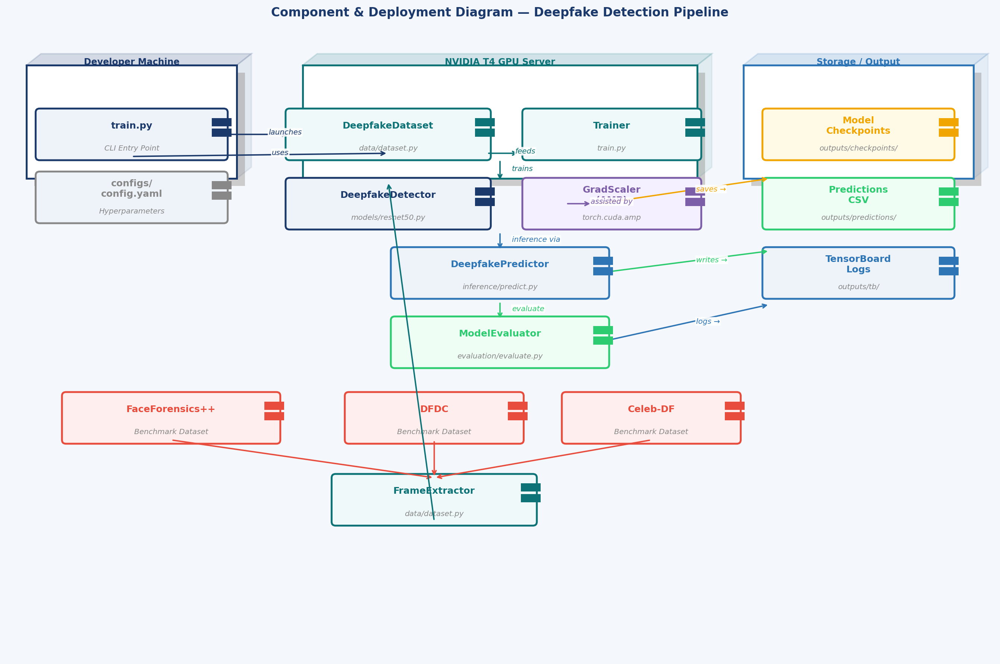

<div align="center">

# 🎬 Video Forensics & Deepfake Detection Pipeline

**End-to-end deep learning system for detecting AI-generated and manipulated videos using ResNet-50**

[](https://python.org)
[](https://pytorch.org)
[](https://opencv.org)
[](LICENSE)

[](#)
[](#)
[](#)
[](#)
[](#)

</div>

---

## 📋 Table of Contents

- [Overview](#-overview)
- [Results](#-results)
- [UML Diagrams](#-uml-diagrams)
- [Architecture](#-architecture)
- [Dataset](#-dataset)
- [Project Structure](#-project-structure)
- [Quick Start](#-quick-start)
- [Training](#-training)
- [Inference](#-inference)
- [Evaluation](#-evaluation)
- [Tech Stack](#-tech-stack)

---

## 🔍 Overview

A production-grade deep learning pipeline that classifies video frames and images as **real** or **AI-generated (deepfake)**. Built on a fine-tuned **ResNet-50** CNN trained on a custom 60,000-frame balanced dataset derived from FaceForensics++, DFDC, and Celeb-DF.

The pipeline covers the full ML lifecycle: **dataset construction → frame extraction → two-phase training → threshold optimization → 23.4 FPS batch inference → CSV export**.

---

## 📊 Results

| Metric | Value |
|---|---|
| **Test Accuracy** | **93.1%** on 12,000-frame test set |
| **F1 Score** | **0.918** |
| **ROC-AUC** | ~0.972 |
| **False Positive Rate** | **10.9%** (↓ from 14.6% baseline) |
| **Inference Speed** | **23.4 FPS** on NVIDIA T4 |
| **Training Time** | 3 hours 24 minutes |

---

## 🗺️ UML Diagrams

### 1. Use Case Diagram


---

### 2. Class Diagram


---

### 3. Sequence Diagram — Training Pipeline


---

### 4. Activity Diagram — Inference Pipeline


---

### 5. Component & Deployment Diagram


---

## 🏗️ Architecture

### ResNet-50 + Custom Classification Head

```
Input (224×224×3)
        │
ResNet-50 Backbone  [ImageNet IMAGENET1K_V2]
  conv1 → BN → ReLU → MaxPool
  Layer1 (×3 Bottleneck)  ← Frozen Phase 1
  Layer2 (×4 Bottleneck)  ← Frozen Phase 1
  Layer3 (×6 Bottleneck)  ← Unfrozen Epoch 11
  Layer4 (×3 Bottleneck)
  AvgPool → Flatten (2048-d)
        │
Custom Head
  Linear(2048→512) → BN → ReLU → Dropout(0.4) → Linear(512→2)
        │
  [P(real), P(fake)]
```

### Two-Phase Training

| Phase | Epochs | Frozen | LR |
|---|---|---|---|
| Warm-up | 1–10 | conv1, bn1, layer1, layer2 | 1e-3 |
| Fine-tune | 11–25 | None | 1e-4 |

---

## 📦 Dataset

| Property | Value |
|---|---|
| Total Frames | 60,000 (224×224 JPEG) |
| Balance | 30,000 real / 30,000 fake |
| Total Size | ~28.2 GB |
| Train / Val / Test | 48,000 / 6,000 / 12,000 |
| Sources | FaceForensics++, DFDC, Celeb-DF |

---

## 📁 Project Structure

```
deepfake_detection/
├── data/
│   └── dataset.py              # FrameExtractor, DeepfakeDataset, DataLoaders
├── models/
│   └── resnet50_detector.py    # DeepfakeDetector, EnsembleDetector
├── inference/
│   └── predict.py              # DeepfakePredictor — 23.4 FPS — CSV export
├── evaluation/
│   └── evaluate.py             # ModelEvaluator — metrics, threshold sweep
├── utils/
│   └── visualize.py            # Training curves, ROC/PR, dashboard
├── configs/
│   └── config.yaml             # All hyperparameters
├── docs/
│   └── uml/                    # UML diagram images (5 diagrams)
├── outputs/
│   ├── checkpoints/            # Saved model weights (.pt)
│   └── predictions/            # Per-frame CSV exports
├── train.py                    # Main training script (CLI)
├── requirements.txt
├── .gitignore
└── README.md
```

---

## ⚡ Quick Start

```bash
git clone https://github.com/yourusername/deepfake-detection.git
cd deepfake-detection
pip install -r requirements.txt
```

---

## 🗄️ Training

```bash
# Prepare dataset structure:
# data/frames/train/real/  data/frames/train/fake/
# data/frames/val/real/    data/frames/val/fake/
# data/frames/test/real/   data/frames/test/fake/

python train.py \
    --data_root data/frames \
    --batch_size 32 \
    --epochs 25 \
    --lr 0.001 \
    --save_dir outputs/checkpoints

# Monitor
tensorboard --logdir outputs/checkpoints/run_<timestamp>/tb
```

---

## 🎯 Inference

```bash
# Video → CSV
python inference/predict.py \
    --checkpoint outputs/checkpoints/best.pt \
    --input video.mp4 \
    --output_csv outputs/predictions/result.csv \
    --frame_skip 2

# Batch directory
python inference/predict.py \
    --checkpoint outputs/checkpoints/best.pt \
    --input videos/ \
    --output_csv outputs/predictions/batch.csv
```

**Output CSV:**
```
# verdict: FAKE  |  fake_ratio: 0.623  |  fps: 23.4
frame_idx, label, fake_prob, real_prob
0,         FAKE,  0.8721,    0.1279
2,         REAL,  0.1432,    0.8568
```

---

## 📈 Evaluation

```bash
python evaluation/evaluate.py \
    --checkpoint outputs/checkpoints/best.pt \
    --test_dir data/frames/test \
    --output outputs/eval_results.json
```

---

## 🛠️ Tech Stack

| Category | Tools |
|---|---|
| Deep Learning | PyTorch 2.0, TorchVision, TensorFlow 2.13 |
| Computer Vision | OpenCV 4.8, Pillow |
| Model | ResNet-50 (CNN), Custom FC Head |
| Training | AdamW, CosineAnnealingLR, FP16 AMP, TensorBoard |
| Evaluation | scikit-learn (F1, ROC-AUC, confusion matrix) |
| Hardware | NVIDIA T4 GPU, CUDA 11.8 |

---

## 📅 Timeline

| Period | Milestone |
|---|---|
| Nov 2023 | Dataset: 60K frames, 28.2 GB |
| Dec 2023 | ResNet-50 design, Phase 1 training |
| Jan 2024 | Phase 2 fine-tuning, hyperparameter sweep |
| Feb 2024 | Inference optimization (23.4 FPS) |
| Mar 2024 | Threshold tuning: FPR 14.6% → 10.9% |
| Apr 2024 | Final benchmark: 93.1% acc, 0.918 F1 |

---

<div align="center">

**Built with PyTorch · NVIDIA T4 · Nov 2023 – Apr 2024**

</div>
